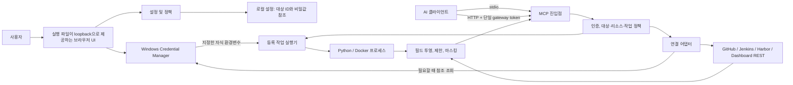

# local-agent-harness 아키텍처

상태: 제품 의도와 제안 설계를 정리한다. 이 문서만으로 구현 완료나 실제 시스템 호환성을 주장하지 않는다.

**Python 경로 경계:** `registered_python_tasks` catalog는 저장된 유효 pin을 settings-only로 읽고 file stat/network 접근을 하지 않는다. 실행은 승인 전, 승인 뒤 비밀값 조회 전, child `Start()` 직전에 파일 SHA-256/size를 확인한다. `.exe`는 256 MiB, `.py`는 16 MiB 상한이며 legacy unpinned tasks는 명시적 review/save 전까지 catalog/run에서 제외된다. Windows에서는 rooted drive-letter path만 받아 UNC 및 DOS/NT device namespace를 거부하지만, mapped network drive를 구별하지 못한다. 마지막 검사 뒤 파일 교체 경합은 남는다.

**Python process 시작 직렬화:** 승인 후 최신 task 설정 대조, 지문 검사, 선택된 secret 조회, 마지막 지문 검사와 child `Start()`가 config lock 아래서 한 덩어리로 실행된다. child가 시작된 뒤 lock을 풀고 완료를 기다리므로 실행 중 설정 변경은 가능하지만 secret 확인과 process 시작 사이에 task mapping 변경은 끼어들지 않는다. approval response는 decision을 넘기기 전에 flush한다. 지문은 마지막 검사 뒤 OS가 파일을 여는 시점의 교체 경합을 없애지 않고, Windows 10 이상에서는 생성 시 job membership을 적용해 일반 CreateProcess 후손의 수명을 관리한다. Win32_Process.Create 등 별도 생성 경로는 포함하지 않는다.

표기: **결정**은 사용자가 정한 제품 의도, **가설**은 검증 전 기본 선택, **검증 전제**는 지원을 선언하기 전에 실제 환경에서 확인할 항목이다.

## 제품 범위

**결정:** Windows 11에서 AI 클라이언트가 등록된 개발 시스템과 작업을 MCP로 사용하도록 돕는 로컬 애플리케이션이다. 사용자는 화면에서 대상, 자격 증명, 허용 작업을 관리한다. 핵심은 대상을 명확히 고르고, 에이전트가 허용된 작업을 수행하게 하며, 응답에 포함된 민감 정보를 모델 문맥으로 보내기 전에 줄이는 것이다.

현재 설계는 GitHub, Jenkins, Harbor, Kubernetes Dashboard REST 대상을 이름 붙여 등록하고 범위를 제한하는 방식이다. 소스에는 등록 SSH 작업과 로컬 Python 작업도 포함된다. Docker 전용 실행기, PostgreSQL, SeaweedFS 및 SCP 기능은 이 릴리스의 지원 범위가 아니다. MCP client 연결 안내는 수동 예시이며 실제 client 호환성을 입증하지 않는다.

원격 배포, LAN 공개, 다중 사용자 서비스는 제품 범위에서 제외한다. 브라우저 UI와 HTTP endpoint가 사용되는 경우 loopback에만 바인딩한다. 현재 앱 시작 경로의 MCP transport는 stdio다.

CLI 설치 안내는 사용자가 직접 실행할 수 있는 stdio 등록·상태 확인 예시와 선택형 진행 체크를 제공한다. 세 체크는 저장된 CLI 서버 목록, 활성 CLI 세션의 도구 목록, `registered_targets` 또는 `registered_service_bundles` 응답을 각각 사용자 보고로 기록한다. 상태는 브라우저 페이지 메모리에만 머물고 새로고침 때 초기화되며, app 설정·클라이언트 설정·네트워크로 보내지 않는다. 이는 클라이언트 연결 상태를 탐지하거나 지원 완료를 선언하는 기능이 아니다.

## 결정 및 가설

- **결정 — UI:** 실행 파일이 정적 UI 파일을 내장하고 loopback으로 제공한 뒤 브라우저를 연다. Windows native 창이나 UI 프레임워크는 도입하지 않는다.
- **현재 구현 — UI 언어:** 내장 UI는 한국어와 영어를 제공하며, 사용자가 선택한 언어 코드를 새로고침 뒤에도 유지한다. 서버가 만든 고정 상태·오류와 Jenkins 승인 화면은 해당 언어로 표시한다.
- **가설 — 실행 형태:** Go 단일 실행 파일이 UI, 설정, MCP 전송, 정책, 연결 어댑터를 제공한다. Windows 사용성 검증에서 한 파일 배포가 문제를 만들 때만 재검토한다.
- **결정 — 대상과 정책:** 대상은 사용자가 정한 안정적인 ID, 유형, 주소, 자격 증명 참조, 리소스 범위로 표현한다. 각 요청은 대상·리소스·작업별 정책을 통과해야 한다. 기본값은 거부다. 사용자가 정확히 미리 허용한 일반 변경은 자동 실행할 수 있다. 삭제·대량·되돌리기 어려운 파괴 작업은 매 호출 별도 사용자 확인을 요구한다.
- **결정 — 비밀값:** 원격 시스템 비밀값은 Windows Credential Manager에 두고 설정에는 참조만 둔다. 전역 환경변수나 `.env` 파일은 만들지 않는다. 값은 연결 호출 또는 등록 작업 직전에 가져온다.
- **결정 — MCP 전송:** stdio와 계속 실행되는 loopback HTTP를 모두 지원하며 같은 정책·출력 처리 경로를 사용한다. 구현과 검증은 단계적으로 진행하지만 두 전송 모두 제품 요구사항이다. HTTP는 단일 HTTP MCP gateway token으로 인증한다. token 이름과 설정 위치는 미정이며 고정 환경변수 이름은 없다. 서비스 자격 증명과 분리하고 앱에서 전체 회전·폐기한다. 클라이언트별 토큰은 필요성이 확인된 뒤 검토한다.
- HTTP MCP 클라이언트 설정에 gateway token을 저장하는 경우 같은 Windows 계정의 프로세스가 그 값을 읽을 수 있다. 이는 Credential Manager에 저장하는 서비스 자격 증명과 구분되는 신뢰 경계다.
- **결정 — 응답:** 모든 연결 및 작업 결과는 MCP 응답 전에 필드 투영, 크기·레코드 제한, 알려진 비밀값 및 일반 자격 증명 형식 마스킹을 통과한다. 오류와 진단도 같은 경계를 적용한다.
- **결정 — Kubernetes:** Kubernetes Dashboard 웹 REST만 대상으로 한다. 클러스터 API 직접 연결이나 별도 대체 경로를 가정하지 않는다.
- **프로토타입 감사에서 제외할 가정:** 기존 코드는 `client-go/rest`와 `remotecommand`로 클러스터 API 주소에 직접 연결하고, 일부 설정과 도구에 `dev`/`prod`가 고정되어 있다. 새 설계에 해당 연결 방식이나 프로필 모델을 가져오지 않는다.

## 구성과 데이터 흐름

아래는 목표 구성을 함께 그린 설계도다. HTTP handler와 server lifecycle 기반 코드는 있으나 app startup과 연결되지 않았으며, HTTP MCP endpoint와 등록 작업 실행기 경로는 제품 동작으로 제공되지 않는다.

UI는 대상·정책·비밀값 참조·작업을 설정하는 관리 경로다. MCP는 요청을 검증하고 정책을 확인한 뒤 등록 어댑터나 작업을 실행하는 사용 경로다. 연결 주소와 자격 증명 이름은 모델이 보내는 인자가 아니라 저장된 대상에서만 가져온다. 외부 응답과 자식 프로세스 출력은 필터를 거치기 전 MCP 결과나 원시 로그에 넣지 않는다.

## 설정과 실행 수명

- 설정에는 스키마 버전, 증가하는 revision, 대상, 자격 증명 참조, 작업 정의, 정책을 저장한다. 현재 Windows 사용자만 읽을 수 있는 앱 데이터 위치를 사용하며 비밀값과 gateway token은 설정 파일에 저장하지 않는다.
- 저장할 때 전체 설정을 검증하고 원자적으로 교체한 뒤 revision을 올린다. 실패하면 이전 설정을 유지한다.
- 새 요청 전에 실행 중인 프로세스는 revision을 확인하고 검증된 설정 스냅샷으로 다시 읽는다. 진행 중인 요청은 시작 시 승인한 스냅샷을 끝까지 사용한다. 다시 읽거나 검증하지 못하면 새 보호 대상 요청을 거부한다.
- 자격 증명 참조가 삭제되거나 유효하지 않으면 해당 작업을 거부한다. 값 교체는 참조를 통해 다음 호출부터 적용한다.
- Harbor/Dashboard의 알려진 필드 검증 오류는 요청별 비밀 제외 초안으로 같은 설정 화면을 HTTP 422로 렌더링한다. 초안은 앱 상태나 파일에 저장하지 않고, template escaping과 `no-store`·`no-referrer` 응답을 사용한다. 비밀번호와 Bearer 입력은 초안 타입에 포함하지 않는다. 제출한 선택 ID가 현재 설정에 없으면 새 대상 선택으로 정규화해 숨은 `target_id`와 선택 UI가 어긋나지 않게 한다. Dashboard 대상 read-check-write는 다른 설정 변경과 같은 설정 잠금 안에서 처리한다.
- HTTP는 loopback만 사용한다. 포트 선택, 자동 시작, 클라이언트별 설정 파일 갱신 방식은 Windows와 각 MCP 클라이언트에서 검증한다.
- **현재 HTTP 기반 코드:** `mcp_http.go`의 handler factory는 전달받은 MCP server를 SDK Streamable HTTP handler로 노출하고, 정확한 loopback Host, 선택적 단일 same-origin HTTP Origin, 고정 길이 Bearer token과 1 MiB 요청 상한을 검사한다. listener helper는 `127.0.0.1`에만 바인딩한다. lock-protected verifier는 in-memory token 교체·폐기를 적용하고 유효하지 않은 교체 입력은 현재 값을 유지한다. 이미 인증을 통과한 요청은 교체·폐기 후에도 진행할 수 있다. 별도 server lifecycle helper는 `WriteTimeout`을 두지 않고, shutdown context 아래서 활성 요청을 drain하며 만료 시 연결을 닫는다. 이 기반 코드는 `runMCP`/app startup에서 호출되지 않는다. token 발급·Credential Manager 영속화·안정적 endpoint provisioning·client 설정 및 실제 client 연결은 미구현이다.
- 단일 gateway token은 모든 연결 클라이언트가 공유하므로 초기 버전에서는 클라이언트별 신원이나 정책 분리를 제공하지 않는다. token 폐기는 전체 클라이언트 연결에 영향을 준다.

## 서비스 묶음·가져오기·GitHub Enterprise

서비스 묶음은 연결 대상과 별개의 사용자 편의 매핑이다. 서비스 묶음은 저장소를 하나 이상 포함하고, 임의 이름의 선택적 환경 아래 등록된 Jenkins job, Harbor 이미지/project, Dashboard namespace·Deployment를 참조한다. 환경 이름 자체에는 고정 권한이나 `dev`/`prod` 의미가 없다. 모든 MCP 요청은 묶음 참조를 해석한 뒤 원래 연결 대상의 리소스·작업 권한을 다시 검사한다.

전체 importer 목표는 선택한 프로젝트의 Git remote, 지정한 문서·Runbook, SSH alias, 기존 연결 설정과 사용자가 지정한 대화 export에서 출처가 있는 후보를 만드는 것이다. 현재 Git config·제한된 `.md`/`.txt` Runbook 후보, 별도 SSH config alias inventory, Local Agent Harness v4/v5/v6/v7 설정 JSON count-only preview, 임의 schema JSON에서 whole-string Git remote 후보를 찾는 read-only preview가 구현됐다. v5~v7은 Python task count를, v7은 file fingerprint 필드도 strict validation한다. 대화 schema/count parser와 archive inventory 의미는 미결정이다.

현재 UI는 Git config와 SSH config를 서로 다른 모드의 파일명 `config` 입력으로, Markdown/text Runbook은 `.md` 또는 `.txt`, 기존 연결 설정과 schema-neutral repository scan은 사용자가 선택한 `.json` 파일로 받는다. 파일명만으로 종류를 자동 추정하지 않는다. 브라우저 File API는 실제 경로를 공개하지 않아 앱이 선택 파일의 실제 위치를 확인할 수 없다. Git·Runbook·SSH 입력은 파일 64 KiB, 요청 72 KiB, JSON 응답 64 KiB로 제한한다. 설정 JSON은 파일 1 MiB, multipart 요청 1 MiB+8 KiB, JSON 응답 8 KiB, JSON remote preview는 같은 입력·요청 상한과 64 KiB JSON 응답 상한을 쓴다.

Git config parser는 지원 remote URL만 처리하며 include나 다른 파일을 따라가지 않고 Git·셸·SSH를 실행하지 않는다. Runbook parser는 UTF-8 512줄까지 검사해 `lah:repository <Git remote URL>` 형식과 정확히 일치하는 줄만 허용하며 고유 참조는 최대 32개다. 그 밖의 Markdown/text 내용은 해석하지 않고 중복 참조는 발생 횟수로 합친다. 응답은 raw URL·문서 원문·파일 경로 대신 source 설명과 repository를 내보낸다. Git/Runbook preview는 활성 설정에서 대상 목록을 읽고, 저장 origin과 repository가 정확히 일치하는 것만 제안한다. 별도 SSH config parser는 최대 512줄·32개 alias의 제한된 리터럴 `Host` alias inventory만 반환하고 `HostName`·사용자·키·proxy 값은 내보내지 않는다. `Include`·`Match`, wildcard·negation, 중복 alias, 전역·중복·비literal `HostName`, 잘못된 `Host`/`HostName` 형식과 줄 이어쓰기는 거부한다. 그 밖의 지시자는 opaque text로 취급하고 파싱·반환·실행하지 않는다. SSH alias와 repository/host/API origin/target 사이에 매핑을 만들지 않는다. 이 preview는 SSH 접속 기능이 아니다. 설정 JSON preview는 Local Agent Harness v4/v5/v6/v7만 strict decode·validate한 뒤 schema version, adapter별 대상 수, 비활성 대상 수, 서비스 묶음·환경 수를 투영하며 v5~v7은 Python 작업 수·비활성 작업 수를 포함한다. v6/v7의 `secret_env_name`·`secret_ref`와 v7 fingerprint 필드는 allowlist·값 검증에만 쓰고 응답에는 세부를 복사하지 않는다. 중복·알 수 없는·case-variant 키와 null 및 후행 데이터는 거부하며 migration을 호출하지 않는다. schema-neutral JSON remote parser는 object key를 무시하고 중첩 JSON value를 순회해 전체 string value만 기존 safe Git remote parser에 전달한다. 4 KiB 초과 value는 건너뛰고 depth 64·token 32,768·canonical unique candidate 32개를 제한한다. duplicate key·invalid UTF-8·malformed/trailing JSON과 상한 초과는 부분 결과 없이 거부한다. 결과는 fixed source label·repository string·low confidence·enabled-target exact-match boolean만 반환하고 URL·host·source key/value·filename·target ID/name은 제외한다. 유효한 전체 document parse 이후에만 active settings를 읽어 normalize된 HTTPS origin과 case-sensitive repository를 비교하며 설정을 변경하지 않는다. SSH와 settings count preview는 active settings를 읽지 않는다. 모든 preview는 Credential Manager를 읽거나 쓰지 않고 외부 network·명령을 실행하지 않는다.

Git preview는 화면·JSON으로 돌려주는 remote alias, repository, matched target name에만 `cleanOutput`의 알려진 패턴 정리를 적용한다. schema-neutral JSON remote preview의 repository 출력도 같은 필터를 통과한다. origin/repository 비교는 원래 파싱·설정 값으로 계속 exact match한다. 패턴 정리는 모든 비밀정보 탐지를 보장하지 않는다.

`registered_targets`와 `registered_service_bundles`의 작업 목록은 저장된 범위에서 호출할 수 있는 도구를 설명할 뿐 사전 승인을 부여하지 않는다. 서버는 매 호출에서 대상·리소스·작업 정책을 다시 검사한다.

`registered_target_connection_test`는 adapter와 정확한 target 표시 이름만 받는다. 서버가 저장 설정에서 활성·유효 대상을 해석하고 기존 adapter 경로(GitHub repository, Jenkins job, Harbor artifact, Dashboard namespace)로 연결을 시험한다. credential이 없거나 요청이 시작되지 않으면 `not_tested`를 반환한다. 시험은 12초로 제한하고 credential byte를 지운다. 기존 이력 저장을 시도하며 UTC `completed_at`은 저장 성공 때만 반환한다. 요청 중 구성이 바뀌거나 대상이 삭제되면 오래된 결과를 history에 기록하지 않는다. 이 도구는 외부 service에 요청하고 local history를 갱신할 수 있음을 설명하며, catalog 조회는 passive 상태를 유지한다.

GitHub adapter는 `403`에 단일 `X-RateLimit-Remaining: 0` 또는 문법이 유효한 단일 `Retry-After`(초 또는 HTTP 날짜)가 있을 때만 이를 rate-limit 신호로 해석한다. 그 외 `403`은 접근 거부다. 해당 헤더 값은 분류 후 폐기되며 오류나 connection history에 저장되지 않는다. 이 분기는 synthetic response tests로 확인했으며 실제 GitHub Enterprise 동작을 검증하지 않는다.

사용자가 후보를 선택하면 서비스 묶음 폼의 기존 target 선택만 바뀐다. 사용자가 폼을 저장해야 지속되며 연결 테스트는 별도 흐름이다. OpenAI의 [일반 export 안내](https://help.openai.com/en/articles/7260999-exporting-your-chatgpt-history-and-data)와 [Edu export 안내](https://help.openai.com/en/articles/20001279-exporting-data-from-a-chatgpt-edu-workspace)는 ZIP과 일부 파일명을 설명하지만 대화 JSON의 안정된 serialization schema를 정의하지 않는다. 따라서 대화 수 parser는 구현하지 않았고 archive entry inventory가 FR-9를 충족하는지는 미결정이다.

### Dashboard 복합 읽기 진단

`dashboard_deployment_diagnosis`는 인자로 서비스 묶음과 환경 이름만 받는다. 서버는 요청마다 활성·유효 Dashboard 대상과 저장된 namespace·Deployment 매핑을 확인하고, 상태·이벤트·Pod inventory를 한 번의 12초 제한 context 아래 병렬 조회한다. inventory 조회는 기존 제한된 ReplicaSet/Pod 경로를 사용하므로 전체 외부 요청은 최대 5회다. 각 단계 결과를 독립적으로 보존해 부분 성공과 안전한 단계별 오류 코드·다음 확인 항목을 반환한다. HTTP 5xx는 typed status error로 분류해 upstream_error와 고정 재시도 안내를 제공하며 응답 본문·주소를 반환하지 않는다. 제한된 오류 표현, 등록 비밀값 마스킹, 민감 필드 투영을 적용하며 전체 MCP 응답 envelope는 64 KiB 이하로 맞춘다.

단계 요청이 병렬이므로 서로 다른 관측 시점의 결과가 함께 있을 수 있고, 원자적 snapshot이라고 해석하면 안 된다. 진단 응답에는 로그가 포함되지 않는다. MCP는 별도 `dashboard_deployment_pod_logs` 도구를 사용하고, UI 결과 패널은 목록에 표시된 Pod/container의 별도 로그 요청을 제공한다. 두 경로는 매번 저장 매핑과 현재 inventory를 재검증하고 12초 안에서 최대 100줄·줄당 4 KiB로 제한한다. MCP 도구는 text content와 structuredContent를 합친 full `CallToolResult` envelope를 64 KiB 이하로 제한하며 UI handler는 JSON response envelope를 별도로 64 KiB 이하로 제한한다. Windows 테스트는 in-memory Dashboard와 MCP transport만 사용했으며 실제 설치·경로·SSO·권한은 미검증이다.

로컬 UI에는 저장된 service bundle/environment Dashboard 매핑을 선택하는 별도 진단 패널이 있다. `/dashboard-diagnosis`는 same-origin POST form만 받고 body를 4 KiB로 제한한다. 필드는 `csrf`, `service_bundle`, `environment` 각각 하나만 허용하며 서버가 기존 `registeredDashboardDeploymentDiagnosis` 경로에서 저장 매핑·대상·credential을 다시 확인한다. 요청은 기존 12초/최대 5 GET/64 KiB 투영 결과를 재사용하고 설정 파일이나 연결 이력을 쓰지 않는다. 결과 패널에는 목록의 Pod/container를 선택해 별도 same-origin POST로 로그를 요청하는 버튼이 있다. `/dashboard-diagnosis-logs`는 Host·Origin·CSRF, 정확한 필드와 4 KiB 요청 상한을 검사한 뒤 기존 등록 logs 경로를 호출한다. 로그 출력은 text-only로 렌더링한다. UI는 부분 단계와 축소 경고를 한·영으로 표현하고 투영 데이터는 text-only JSON으로 보여준다.

### Jenkins job 경계와 상태 흐름

Trigger는 기본 거부한다. 등록 UI의 명시적 체크는 정확한 등록 job이 비운영이라는 attestation이며, 이를 저장한 job만 매 호출 UI 확인 없이 trigger할 수 있다. 그 밖의 job은 호출마다 loopback 브라우저에서 1회 확인을 받아야 한다. 확인 화면은 등록 대상 이름, proxy/context path를 포함한 정확한 Jenkins base URL, 임의 environment label, 고정 job path를 보여준다. label로 운영 여부나 허용을 추론하지 않는다. 거부·취소·시간 초과·listener/브라우저 실행 실패 또는 확인 후 대상 설정 변경은 POST 전에 fail closed 한다.

MCP는 UI에 등록한 target name, HTTPS base/context, 고정 job path와 credential reference만 사용하며 job path나 build parameter를 인자로 받지 않는다. Trigger는 해당 job의 저장된 비운영 attestation과 사전 허용 또는 그 호출에 대한 loopback 확인이 있어야 POST할 수 있다.

실행은 등록 job의 buildable 확인 뒤 parameter 없는 POST 한 번으로 시작한다. 전송 오류·redirect·5xx 등 수락 여부가 모호하거나, 201 응답의 queue Location이 누락·검증 실패하면 `outcome_unknown`과 수동 queue 확인·재시도 금지 안내로 끝낸다. 수락된 POST는 같은 origin/context의 숫자 queue ID를 확인하고 queue record ID와 task name/URL을 등록 job에 결합한다. 대기 시 queue ID를 반환하고, 승인 뒤 점검 실패는 `inspection_pending`으로 돌려 재trigger하지 않는다. Build number는 build 응답과 대조한다.

Queue 상태 조회와 build log는 별도 read-only MCP 도구다. Log page는 offset으로 가져오며 page당 32 KiB를 제한하고 progressive response의 `X-Text-Size`/`X-More-Data`를 검사한다. 알려진 credential 및 일반 자격 증명 형식은 마스킹하지만 완전한 비밀 유출 방지를 보장하지 않는다. 로컬 mock 결과는 실제 회사 Jenkins 설치·권한·proxy 연결 검증이 아니다.

## Kubernetes Dashboard 검증 전제

구현 설계 기준은 공식 [Kubernetes Dashboard Helm chart release 7.14.0](https://github.com/kubernetes-retired/dashboard/tree/4940626339ee16a5261acc28ad814190636b3ba9)이다. `7.14.0`은 chart version이며 앱 버전이 아니다. tag의 `charts/kubernetes-dashboard/Chart.yaml`에는 `appVersion`이 없고 지정된 이미지 조합은 auth `1.4.0`, API `1.14.0`, web `1.7.0`, metrics-scraper `1.2.2`다.

구현 전에 chart 경로 `charts/kubernetes-dashboard/{values.yaml,templates/deployments,templates/services,templates/networking/ingress.yaml,templates/config/gateway.yaml}`와 component source `modules/{web,auth,api}`를 읽는다. UI 인증 흐름은 [`authentication.ts`](https://github.com/kubernetes-retired/dashboard/blob/4940626339ee16a5261acc28ad814190636b3ba9/modules/web/src/common/services/global/authentication.ts)와 [`interceptor.ts`](https://github.com/kubernetes-retired/dashboard/blob/4940626339ee16a5261acc28ad814190636b3ba9/modules/web/src/common/services/global/interceptor.ts)에 정의되어 있다. UI는 `GET /api/v1/csrftoken/login` 응답의 CSRF token으로 `X-CSRF-TOKEN`을 넣어 `POST /api/v1/login`을 호출하고, 반환된 token을 SameSite Strict cookie에 저장한 뒤 후속 API 요청에 `Authorization: Bearer`로 보낸다. API는 [`init.go`](https://github.com/kubernetes-retired/dashboard/blob/4940626339ee16a5261acc28ad814190636b3ba9/modules/common/client/init.go)에서 인증 헤더를 검사한다. chart의 [`gateway.yaml`](https://github.com/kubernetes-retired/dashboard/blob/4940626339ee16a5261acc28ad814190636b3ba9/charts/kubernetes-dashboard/templates/config/gateway.yaml)는 login·CSRF·me 경로를 auth로, `/api`를 API로 라우팅한다. [`ingress.yaml`](https://github.com/kubernetes-retired/dashboard/blob/4940626339ee16a5261acc28ad814190636b3ba9/charts/kubernetes-dashboard/templates/networking/ingress.yaml)는 외부 ingress 설정 근거다.

사용자가 Dashboard 기본 주소를 입력한다. 공식 UI source의 로그인·쿠키 동작을 회사 설정에 그대로 가정하지 말고, 저장된 Bearer 자격 증명으로 웹 REST를 호출할 수 있는지 구현 중 확인한다. 회사 설치 chart/component 버전, base URL/subpath, proxy rewrite, SSO, 인증 및 API 권한은 검증 전이다. 공식 tag source만으로 회사 설치 호환성을 선언하지 않는다. 어댑터는 확인된 Dashboard 웹 REST만 대상으로 하며 `client-go/rest`, `remotecommand`, 직접 Kubernetes API 주소는 대체 경로로 가져오지 않는다.

## 외부 API 기준선 (상류 소스 참고만)

아래 버전은 API 경로와 인증 코드를 조사한 상류 기준이다. 설치된 회사 시스템의 Harbor/Dashboard 버전, URL prefix·rewrite, reverse proxy의 인증 헤더 전달, 실제 권한은 확인하지 않았다. 따라서 이 근거만으로 배포 환경 지원을 선언하지 않는다.

### Kubernetes Dashboard 7.14.0

기준은 [불변 `kubernetes-dashboard-7.14.0` 태그](https://github.com/kubernetes-retired/dashboard/tree/4940626339ee16a5261acc28ad814190636b3ba9)다. [인증 문서](https://github.com/kubernetes-retired/dashboard/blob/4940626339ee16a5261acc28ad814190636b3ba9/docs/user/access-control/README.md#L27-L49)는 요청별 `Authorization: Bearer <token>` 헤더와 로그인 화면의 Bearer token 입력을 설명한다. UI 로그인은 [`GET /api/v1/csrftoken/login`](https://github.com/kubernetes-retired/dashboard/blob/4940626339ee16a5261acc28ad814190636b3ba9/modules/web/src/common/services/global/csrftoken.ts#L24-L27) 뒤 `X-CSRF-TOKEN`을 포함해 `POST /api/v1/login`을 호출하고, UI interceptor는 저장한 토큰을 API 요청의 Authorization 헤더로 보낸다([`authentication.ts`](https://github.com/kubernetes-retired/dashboard/blob/4940626339ee16a5261acc28ad814190636b3ba9/modules/web/src/common/services/global/authentication.ts#L48-L65), [`interceptor.ts`](https://github.com/kubernetes-retired/dashboard/blob/4940626339ee16a5261acc28ad814190636b3ba9/modules/web/src/common/services/global/interceptor.ts#L38-L47)).

Dashboard API 등록 코드의 조회 경로는 모두 `/api/v1` 아래다([namespace·event](https://github.com/kubernetes-retired/dashboard/blob/4940626339ee16a5261acc28ad814190636b3ba9/modules/api/pkg/handler/apihandler.go#L592-L626), [Pod](https://github.com/kubernetes-retired/dashboard/blob/4940626339ee16a5261acc28ad814190636b3ba9/modules/api/pkg/handler/apihandler.go#L274-L311), [Deployment](https://github.com/kubernetes-retired/dashboard/blob/4940626339ee16a5261acc28ad814190636b3ba9/modules/api/pkg/handler/apihandler.go#L330-L359), [raw resource·log](https://github.com/kubernetes-retired/dashboard/blob/4940626339ee16a5261acc28ad814190636b3ba9/modules/api/pkg/handler/apihandler.go#L914-L922)):

| 조회 | Dashboard REST 경로 |
|---|---|
| Namespace | `GET /api/v1/namespace` |
| Deployment | `GET /api/v1/deployment/{namespace}` 및 `GET /api/v1/deployment/{namespace}/{deployment}` |
| Pod | `GET /api/v1/pod/{namespace}` 및 `GET /api/v1/pod/{namespace}/{pod}` |
| Event | `GET /api/v1/event/{namespace}`, Pod/Deployment 상세 경로 뒤 `/event` |
| Raw resource | `GET /api/v1/_raw/{kind}/namespace/{namespace}/name/{name}` |
| Log | `GET /api/v1/log/{namespace}/{pod}/{container}`; 로그 파일은 `/api/v1/log/file/{namespace}/{pod}/{container}` |

Gateway 소스는 login·login-CSRF·`/me`를 auth service로, `/api`를 API service로 연결한다([`gateway.yaml`](https://github.com/kubernetes-retired/dashboard/blob/4940626339ee16a5261acc28ad814190636b3ba9/charts/kubernetes-dashboard/templates/config/gateway.yaml#L26-L55)). 외부에서 이 경로가 그대로 도달 가능한지는 ingress와 proxy 설정을 확인해야 한다.

#### Pod exec 전송 (미구현)

고정 기준인 [Dashboard 7.14.0 source](https://github.com/kubernetes-retired/dashboard/tree/4940626339ee16a5261acc28ad814190636b3ba9)는 `GET /api/v1/pod/{namespace}/{pod}/shell/{container}`를 등록한다. handler는 임의 session ID를 만들어 반환하고, UI는 SockJS `/api/sockjs?{id}`에 연결해 JSON `bind`, `stdin`, `resize` frame을 보낸다([API route와 handler](https://github.com/kubernetes-retired/dashboard/blob/4940626339ee16a5261acc28ad814190636b3ba9/modules/api/pkg/handler/apihandler.go#L312-L320), [UI caller](https://github.com/kubernetes-retired/dashboard/blob/4940626339ee16a5261acc28ad814190636b3ba9/modules/web/src/shell/component.ts#L182-L217), [SockJS handler](https://github.com/kubernetes-retired/dashboard/blob/4940626339ee16a5261acc28ad814190636b3ba9/modules/api/pkg/handler/terminal.go#L177-L214)). 브라우저 전송은 raw WebSocket 계약이 아닌 SockJS이며, Dashboard backend는 client-go SPDY로 Pod `exec` 요청을 보낸다([backend](https://github.com/kubernetes-retired/dashboard/blob/4940626339ee16a5261acc28ad814190636b3ba9/modules/api/pkg/handler/terminal.go#L216-L249)).

UI는 bootstrap GET에 Bearer token을 보내고 handler는 해당 요청으로 Kubernetes client config를 만든다([UI interceptor](https://github.com/kubernetes-retired/dashboard/blob/4940626339ee16a5261acc28ad814190636b3ba9/modules/web/src/common/services/global/interceptor.ts#L38-L47), [handler](https://github.com/kubernetes-retired/dashboard/blob/4940626339ee16a5261acc28ad814190636b3ba9/modules/api/pkg/handler/apihandler.go#L2179-L2205)). SockJS handler는 `/api/v1` filter와 별도로 마운트되며 `bind`에서 Bearer token을 다시 검사하지 않는다. 이 내용은 상류 source 기준일 뿐이다. 회사 설치본과 proxy 경로는 확인하지 않았고 SockJS `Origin` 동작은 `DefaultOptions`에 위임되어 Dashboard source만으로 검증되지 않았다. 현재 MCP 범위에는 exec 도구가 없다.

### Harbor 2.15.2

기준은 불변 [`v2.15.2` 태그의 OpenAPI](https://github.com/goharbor/harbor/blob/080b0220574cc853ae1e2946ce7a5610ba855757/api/v2.0/swagger.yaml)이며 API prefix는 `/api/v2.0`이다. OpenAPI는 HTTP Basic 인증을 정의하고, upstream middleware는 사용자 Basic 자격 증명과 robot account Basic 자격 증명을 처리한다([`basic_auth.go`](https://github.com/goharbor/harbor/blob/080b0220574cc853ae1e2946ce7a5610ba855757/src/server/middleware/security/basic_auth.go#L60-L80), [`robot.go`](https://github.com/goharbor/harbor/blob/080b0220574cc853ae1e2946ce7a5610ba855757/src/server/middleware/security/robot.go#L34-L72)).

| 조회 | Harbor REST 경로와 범위 |
|---|---|
| Repository | [`GET /api/v2.0/projects/{project_name}/repositories/{repository_name}`](https://github.com/goharbor/harbor/blob/080b0220574cc853ae1e2946ce7a5610ba855757/api/v2.0/swagger.yaml#L884-L910); count와 metadata 조회 |
| Artifact/tag/digest/size | [`GET /api/v2.0/projects/{project_name}/repositories/{repository_name}/artifacts`](https://github.com/goharbor/harbor/blob/080b0220574cc853ae1e2946ce7a5610ba855757/api/v2.0/swagger.yaml#L962-L1027); `Artifact`에 digest, size, tags가 있다([schema](https://github.com/goharbor/harbor/blob/080b0220574cc853ae1e2946ce7a5610ba855757/api/v2.0/swagger.yaml#L6602-L6661)). 목록은 `page`, `page_size`, `with_tag=true`를 지원한다. 단건은 [`/artifacts/{reference}`](https://github.com/goharbor/harbor/blob/080b0220574cc853ae1e2946ce7a5610ba855757/api/v2.0/swagger.yaml#L1068-L1140)이며 reference는 tag 또는 digest다. Tag metadata 목록은 [`GET /api/v2.0/projects/{project_name}/repositories/{repository_name}/artifacts/{reference}/tags`](https://github.com/goharbor/harbor/blob/080b0220574cc853ae1e2946ce7a5610ba855757/api/v2.0/swagger.yaml#L1262-L1341)이다. |
| Project quota | [`GET /api/v2.0/projects/{project_name_or_id}/summary`](https://github.com/goharbor/harbor/blob/080b0220574cc853ae1e2946ce7a5610ba855757/api/v2.0/swagger.yaml#L467-L490); quota per project가 켜져 있고 caller에 project `quota:read` 권한이 있을 때 hard/used 값을 포함한다([권한·구현](https://github.com/goharbor/harbor/blob/080b0220574cc853ae1e2946ce7a5610ba855757/src/server/v2.0/handler/project.go#L375-L422)). |
| System quota | [`GET /api/v2.0/quotas`](https://github.com/goharbor/harbor/blob/080b0220574cc853ae1e2946ce7a5610ba855757/api/v2.0/swagger.yaml#L3219-L3294) 및 `/api/v2.0/quotas/{id}`; system quota list/read 권한이 필요하다([handler](https://github.com/goharbor/harbor/blob/080b0220574cc853ae1e2946ce7a5610ba855757/src/server/v2.0/handler/quota.go#L44-L79)). |
| Volume capacity | [`GET /api/v2.0/systeminfo/volumes`](https://github.com/goharbor/harbor/blob/080b0220574cc853ae1e2946ce7a5610ba855757/api/v2.0/swagger.yaml#L4115-L4137); 관리자에게만 허용되는 system volume read 권한이 필요하고 응답은 local disk의 total/free만 나타낸다([handler](https://github.com/goharbor/harbor/blob/080b0220574cc853ae1e2946ce7a5610ba855757/src/server/v2.0/handler/systeminfo.go#L62-L78)). 외부 object storage의 여유 용량을 뜻하지 않는다. |

Artifact `size`는 개별 artifact 메타데이터다. Harbor project quota 사용량은 artifact size 단순 합계가 아니라 project에 연결된 blob 크기를 집계하며 foreign layer를 제외할 수 있다([quota driver](https://github.com/goharbor/harbor/blob/080b0220574cc853ae1e2946ce7a5610ba855757/src/controller/quota/driver/project/project.go#L109-L120), [blob DAO](https://github.com/goharbor/harbor/blob/080b0220574cc853ae1e2946ce7a5610ba855757/src/pkg/blob/dao/dao.go#L276-L298)). 이 차이를 유지하고, volume API 값을 Harbor 전체 저장 용량이나 object storage 용량으로 표현하지 않는다.

## 확장 체크리스트

1. 대상·리소스·작업 범위와 기본 거부 정책을 정의한다.
2. 주소, 자격 증명 참조, 입력과 응답 스키마를 정하고 MCP 인자로 임의 주소를 받지 않는다.
3. 등록된 대상만 호출하고 TLS, 제한 시간, 페이지 처리를 확인한다.
4. 응답 필드를 줄이고 크기·레코드 수를 제한하며 알려진 비밀값, 오류, 로그를 마스킹한다.
5. 원격 변경 전에 대상·리소스·작업 정책을 확인한다. 조회, 변경, 파괴적 작업을 구분한다.
6. 허용·거부, 잘못된 입력, 과대 응답, 비밀값 canary, 오류·로그 경로를 시험한다. 실제 시스템 검증 후에만 지원을 선언한다.

## 미검증 항목

이 문서는 설계 제안이며 실제 서비스·클라이언트 호환성을 보증하지 않는다. 배포별 검증 결과와 한계는 해당 릴리스의 검증 요약을 확인한다. 실제 서비스의 설치 버전·REST 경로·인증 방식, 각 클라이언트의 버전과 연결, Windows 설치·비밀 저장·프로세스 수명은 별도 환경에서 확인해야 한다.