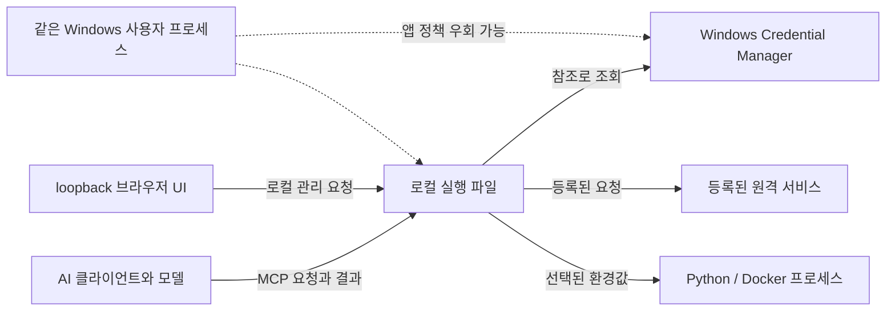

# local-agent-harness 보안 설계

상태: 제품 보안 요구사항이다. 아래 통제는 구현 완료나 검증 완료를 의미하지 않는다.

MCP Dashboard 로그 응답은 serialized full `CallToolResult` envelope 기준 64 KiB 이하이며 UI 로그 endpoint JSON response도 별도로 64 KiB 이하이다. 등록 Python 작업 출력은 현재 MCP 호출에만 stream당 8 KiB까지 반환할 수 있다. 알려진 secret/pattern 필터링은 best-effort이며 초과·해석·필터·정리 확인 실패에서는 해당 출력을 생략하지만 모든 secret을 제거한다고 보장하지 않는다. synthetic tests와 local UI mock만 근거이며 실제 service, secret store round-trip, Python runtime은 미검증이다.

## 신뢰 모델

도구는 로그인한 Windows 사용자 권한으로 동작한다. MCP 요청, 모델이 만든 인자, 원격 응답, 로그, 작업 출력은 신뢰하지 않는다. Windows Credential Manager는 다른 OS 사용자로부터 값을 보호하고 우발 노출을 줄이지만, 같은 Windows 계정의 프로세스로부터 비밀값을 격리하지는 않는다. 원격 사용이나 다중 사용자 서비스는 지원 범위가 아니다.

보호할 자산은 원격 서비스 비밀값, 단일 gateway token, 대상·리소스·작업 정책, 작업 설정, 모델에 반환될 데이터와 자식 프로세스에 전달되는 임시 값이다.

앱 정책은 이 도구를 통과하는 MCP 요청에만 적용된다. 같은 계정의 셸이나 다른 AI 도구가 수행하는 동작은 통제하지 않는다.

## 필수 통제

아래는 구현 경로별 목표 통제다. 현재 stdio MCP와 UI에 적용된 부분은 코드·모의 테스트 범위에서 확인했다. HTTP MCP의 handler, in-memory verifier, 별도 `http.Server`의 loopback start/shutdown 기반 코드는 구현했지만 app에서 실행되지 않는다. lifecycle helper는 SSE 호환을 위해 `WriteTimeout`을 두지 않고 shutdown 시 token verifier를 폐기하며, 제한 시간 안에 활성 요청이 끝나지 않으면 연결을 닫는다. token 발급·영속 보관, Credential Manager와 verifier 연결, 앱 startup 연결은 아직 없다. Python task 설정 schema v7은 환경 변수명·`secret_ref`와 `.exe`·`.py` SHA-256 및 크기를 저장한다. v5/v6 migration은 기존 task와 secret mapping을 보존하지만 file fingerprint는 자동 생성하지 않으므로 사용자의 명시적 file review/save 전까지 catalog/run에서 제외한다. 저장 UI의 비밀 입력값은 다시 표시하지 않고, 빈 입력은 기존 매핑을 유지하며 별도 확인으로 해제한다. MCP 실행은 정확한 task name만 입력으로 받고 매번 일회성 loopback browser approval을 거친다. `.exe` 256 MiB와 `.py` 16 MiB 상한 안에서 SHA-256 지문을 승인 전, 승인 후 secret 조회 전, child 시작 직전에 확인하고 mismatch·missing·read failure·oversize를 fail-closed로 차단한다. 승인 화면은 task name과 선택된 환경 변수명만 보여주며 path·ref·secret을 감춘다. 승인/설정/파일 확인 뒤 정확히 해당 task의 참조를 읽고 값 검증에 실패하면 프로세스 실행 전에 차단한다. Windows child 환경은 사용 가능한 `SystemRoot`·`TEMP`·`TMP`에 설정된 단일 secret 변수만 더한다. 키는 64자 이내 제한 문자와 예약 변수 차단을 적용하고 secret은 비어 있지 않은 UTF-8·NUL 없음·4096 byte 이하로 제한한다. `defer clear`와 환경 slice 정리는 최선 노력일 뿐 Go 문자열·Windows process environment block·child memory에서 제거를 보장하지 않는다. 후손은 secret을 물려받을 수 있다. Windows 10 이상에서는 루트 생성 시 private Job Object에 포함하고 일반 CreateProcess 후손을 root 종료·실패·취소·시간 초과 뒤 정리하며, active task-tree slot은 job이 비워질 때까지 유지한다. 정리를 확인하지 못하면 앱 재시작까지 추가 task 실행을 차단한다. Win32_Process.Create 등 Job 밖 생성 경로는 포함되지 않는다. 비-Windows fallback은 직접 자식만 기다린다. 승인 대기 최대 2개, Windows active task tree 최대 2개, 호출당 30초 제한은 유지한다. passive task catalog는 settings만 읽고 path metadata를 조회하지 않는다. Windows에서는 rooted drive-letter path만 허용해 UNC·DOS/NT device namespace를 거부하지만 mapped network drive 여부는 식별하지 못한다. Python bounded output/redaction은 합성 child로 검증했으며 알려진 패턴 필터가 모든 비밀 제거를 보장하지 않는다. Docker 작업은 미구현이다. Windows Job Object process-tree lifetime/cancellation은 synthetic child tree에서 검증했으며 실 Python runtime 검증은 아니다. File pinning은 구현됐지만 마지막 확인 뒤 실행 시점까지 race-free를 보장하지 않는다. fake store와 synthetic child 테스트는 실제 Credential Manager, Python runtime 또는 desktop approval을 검증하지 않는다.

승인 뒤 최신 설정 대조, 지문 검사, 선택 secret 조회, 마지막 지문 확인과 child `Start()`는 config lock 아래 직렬화해 task mapping이 그 사이에 바뀌지 않게 한다. child가 시작되면 lock을 풀고 `Wait()`를 진행하므로 실행 완료까지 설정 쓰기를 잠그지는 않는다. approval response를 decision 신호 전에 flush해 브라우저 응답이 닫히기 전에 전달되도록 한다. 지문 검사는 감지 시점의 변경 파일을 거부하지만 마지막 검사 뒤 OS가 파일을 여는 시점까지 race-free를 보장하지 않는다.

`mcp_http.go`의 handler는 호출자가 주입한 MCP server와 32바이트 hexadecimal token verifier를 사용한다. `Authorization`에는 Bearer scheme 한 개만 허용하고 constant-time byte comparison을 적용한다. 요청의 Host는 설정된 loopback IP:port와 정확히 같아야 하며 `Origin`이 있을 경우 하나의 정확한 `http://<loopback-host>` 값만 허용한다. Origin header가 없는 native MCP 요청은 허용한다. `http.NewCrossOriginProtection`을 함께 사용하고 CORS 허용 헤더는 추가하지 않는다. SDK request body는 1 MiB로 제한한다. listener helper는 `tcp4` `127.0.0.1`만 사용한다. verifier는 lock으로 보호된 in-memory token 교체·폐기를 지원하며 요청 인증은 현재 token과 비교한다. tests는 synthetic token과 in-process client/server를 쓰며 product endpoint, Credential Manager lifecycle 또는 외부 서비스에 대한 검증은 아니다.

runtime은 Credential Manager의 저장·삭제와 verifier의 `replace`·`revoke`를 같은 lifecycle 안에서 연결해야 한다. 현재 앱에는 그 wiring이 없다. 교체 검증·반영 및 폐기는 verifier lock으로 직렬화하며, 잘못된 교체 입력은 현재 token을 유지한다. 동시에 호출된 lifecycle mutation의 적용 순서는 lock 획득 순서이므로 상위 UI/runtime은 의미 있는 event 순서를 직접 직렬화해야 한다. verifier가 인증을 허용한 뒤 시작된 요청은 이후 revoke로 중단되지 않는다. Go 메모리 정리는 best-effort이며 다른 메모리 복사본이 없다고 보장하지 않는다.

- 원격 서비스 비밀값을 설정 파일, MCP 상태·검색 응답, 결과, 오류, 로그에 넣지 않는다. 설정에는 참조만 두고 연결 또는 등록 작업 직전에 조회한다.
- HTTP MCP gateway token은 loopback HTTP MCP 접속 인증에만 사용하며 서비스 계정 비밀값과 분리한다. token의 고정 환경변수 이름은 아직 정하지 않았다. 앱에서 전체 회전·폐기하며, 회전 뒤 연결된 모든 클라이언트를 갱신해야 한다. 초기에는 클라이언트별 token이나 클라이언트별 정책 구분이 없다.
- gateway token 원문은 앱 화면·MCP 응답·오류·로그와 설정 JSON에 넣지 않는다. 클라이언트가 인증에 필요한 값은 같은 Windows 사용자 프로세스가 읽을 수 있는 별도 신뢰 경계다. provisioning 경로는 토큰을 앱 화면에 렌더링하지 않으면서 사용자가 의도적으로 클라이언트를 설정할 수 있는 방법을 정해야 한다.
- 클라이언트 설정에 gateway token을 저장하는 경우 같은 Windows 계정의 프로세스가 그 값을 읽을 수 있다. 이는 Credential Manager에 저장하는 서비스 자격 증명과 별개의 신뢰 경계다.
- UI와 HTTP MCP를 loopback에만 바인딩하고 외부 인터페이스 요청을 거부한다. HTTP MCP에는 gateway token을 요구한다. UI 관리 요청은 origin 및 CSRF 공격을 막고 넓은 CORS를 허용하지 않는다. loopback만으로 인증이 되지는 않는다.
- UI 언어 선택용 `lah_lang` 쿠키와 `lah-lang` 로컬 저장소에는 `en` 또는 `ko`만 기록한다. 인증·비밀값·대상 정보는 이 저장소에 넣지 않는다. 이 쿠키는 UI 상태 선택용이며 접근 제어 수단이 아니다.
- Harbor/Dashboard의 알려진 입력 검증 실패 페이지는 요청별 구조체에 이름·주소·사용자명·project·repository만 복사해 HTTP 422로 다시 렌더링한다. 해당 타입에는 비밀번호·Bearer 필드가 없고, 응답은 `no-store`·`no-referrer`, HTML template escaping을 사용한다. 등록되지 않거나 삭제된 선택 ID는 `new`로 정규화한다. 초안은 URL·쿠키·브라우저 저장소·공유 상태·로그에 넣지 않는다. 저장 side effect가 발생할 수 있는 일반 I/O 오류는 이 재렌더 경로를 사용하지 않는다.
- stdio와 HTTP는 같은 대상·리소스·작업 정책을 적용한다. stdio 프로세스와 현재 사용자는 같은 OS 보안 경계에 있으므로, 이를 같은 계정의 다른 프로세스에 대한 격리로 설명하지 않는다.
- 기본 거부한다. MCP 인자로 임의 주소, 자격 증명 이름, 실행 파일, 셸 명령을 받지 않는다. 사용자가 구체적으로 미리 허용한 일반 변경만 자동 실행한다.
- 대상 주소는 사용자가 등록한 설정에서만 가져온다. TLS 인증서를 검증하고, 등록되지 않은 origin으로 리다이렉트할 때 자격 증명을 전달하지 않는다.
- 모든 응답은 MCP 반환 전에 허용 필드만 남기고 크기·레코드 수를 제한한다. 등록된 비밀값과 알려진 자격 증명 형식을 마스킹하고 제어 문자를 정리한다. 오류와 진단에도 같은 경계를 적용하며 원시 응답을 기본 로그로 남기지 않는다.
- 원격 콘텐츠와 작업 출력은 신뢰하지 않고 결과 데이터로 취급한다. 이를 받은 모델은 영향을 받아 허용된 MCP 작업을 요청할 수 있다. 앱은 매 요청마다 저장된 대상·리소스·작업 정책을 서버에서 다시 검사한다. 이 검사는 모델의 판단이나 요청 자체를 막는 보장이 아니다.
- 사용자가 UI에서 명시적으로 미리 허용한 일반 변경은 추가 확인 없이 실행한다. 삭제·대량·되돌리기 어려운 파괴 작업은 매 호출 별도 사용자 확인을 받은 뒤 실행하며, 확인 경로가 없으면 거부한다.
- 작업은 사전 등록한 실행 파일, 작업 디렉터리, 허용 인자와 변수-비밀값 참조 연결을 사용한다. 지정된 값만 자식 프로세스에 전달하고 `.env`, 전역 환경변수, 명령행 인자로 비밀값을 쓰지 않는다. 자식 출력은 필터 후 MCP로 반환한다.
- 설정은 사용자 계정에 한정하고 원자적으로 저장한다. 잘못된 설정, 자격 증명 누락, 권한 불일치, revision 재검증 실패 시 요청을 거부한다. 설정 내보내기나 백업에 비밀값을 포함하지 않는다.

## 등록 초안·서비스 묶음·카탈로그 경계

`registered_target_connection_test`는 어댑터와 정확한 저장 target 이름만 받고 URL·리소스·credential·권한을 입력으로 받지 않는다. 서버가 대상 활성/유효성 및 저장 credential을 다시 확인하고 기존 제한된 GET 경로 한 번만 사용한다. 12초 제한과 기존 응답 필터를 적용하고 secret byte를 지운다. 고정된 안전 결과만 반환하며 endpoint·ID·credential reference·response body/header/raw error는 응답에 넣지 않는다. 호출은 외부 service request와 local history write를 일으킬 수 있어 tool description에 이를 고지한다. 요청이 시작되지 않으면 이력을 쓰지 않고 `not_tested`로 응답하며 `completed_at`은 history write 성공 시에만 포함한다. 대상이 바뀌거나 삭제되면 오래된 결과를 기록하지 않는다. 도구의 권한은 등록된 기존 read-only GET 한 건이고 catalog 조회의 passive 속성은 유지된다.

GitHub connection diagnostic은 `403`에서 단일 `X-RateLimit-Remaining: 0` 또는 문법이 유효한 단일 `Retry-After`(초 또는 HTTP 날짜) header만 분류 신호로 사용한다. 공백·잘못된 값과 중복 header 값은 rate-limit 신호로 인정하지 않는다. 응답 header 전체와 rate-limit header 값은 로그·UI·MCP·history로 복사하지 않는다. Mock tests가 이 분기와 고정 진단만 확인한다.

사용자 지정 target·서비스 묶음·환경 표시 이름은 AI 카탈로그에 전달되므로 이름에 비밀값을 넣지 않는다. 서비스 묶음과 환경은 등록된 연결 대상·리소스의 참조만 보관한다. 임의 환경 이름은 권한이 아니며, 위험 작업 여부는 별도 대상·리소스·작업 정책으로 지정하고 MCP 서버가 매 요청마다 검사한다. 기본 권한은 조회다.

전체 importer의 입력원(Git remote, 선택한 문서·Runbook, SSH config, 기존 연결 설정 및 사용자가 고른 대화·내보내기 자료)은 불신 입력이다. 다른 클라이언트의 대화 전체를 자동 탐색하지 않는다. `.env`·인증 파일의 원문 비밀값을 AI에게 보내거나 로그에 쓰지 않는다. 새 비밀 연결이나 권한 증가는 출처·변경 내용·허용 범위를 보여주는 UI 승인 후 적용한다.

현재 importer는 사용자가 직접 선택한 Git config, `.md`/`.txt` 문서·Runbook, 별도 SSH config 파일, Local Agent Harness 설정 JSON과 schema-neutral JSON repository scan을 각각 하나씩 받는다. Git·Runbook·SSH 입력은 파일 64 KiB, multipart 요청 72 KiB, JSON 응답 64 KiB다. 설정 JSON은 파일 1 MiB, 요청 1 MiB+8 KiB, 응답 8 KiB이며 JSON repository scan은 같은 입력·요청 상한과 64 KiB response를 쓴다. 브라우저 File API가 실제 경로를 공개하지 않아 실제 원본의 로컬 경로를 확인하지 못한다. Git 제한 parser는 지원 remote URL만 추출하고 include나 다른 파일을 따라가지 않으며 Git·셸·SSH를 실행하지 않는다. Runbook 파서는 선택한 `.md`/`.txt` 파일의 UTF-8을 최대 512줄까지 검사해 `lah:repository <Git remote URL>` 형식의 지시자만 처리하고 고유 참조를 32개로 제한한다. SSH parser는 최대 512줄·32개 alias의 제한된 리터럴 `Host` alias 이름만 응답에 포함한다. `HostName`·사용자·키·proxy 값은 반환하지 않는다. `Include`·`Match`, wildcard·negation, 중복 alias, 전역·중복·비literal `HostName`, 잘못된 `Host`/`HostName` 형식과 줄 이어쓰기는 거부한다. 그 밖의 지시자는 opaque text로 취급하며 파싱·반환·실행하지 않는다. 일반 문서 텍스트와 임의 URL은 해석하지 않는다.

미리보기 응답은 업로드 원문과 파일 경로를 포함하지 않는다. Git/Runbook/JSON remote candidate preview는 후보를 맞추기 위해 활성 설정을 읽지만 변경하지 않으며, SSH alias와 settings count preview는 활성 설정을 읽지 않는다. 어느 preview도 Credential Manager를 읽거나 쓰지 않는다. Git/Runbook 후보는 기존 활성 GitHub 대상과 origin/repository가 정확히 일치하는 경우만 제안하며 후보당 최대 8개를 표시한다. JSON remote preview는 유효한 전체 JSON을 파싱한 뒤에만 normalize된 HTTPS origin과 case-sensitive repository를 비교해 boolean match만 계산한다. 입력 key를 무시하고 정확한 전체 문자열 값만 검사하며 4 KiB 초과 값은 건너뛴다. depth 64, 32,768 decoder token, 32 unique candidates 상한과 duplicate key/malformed/trailing/invalid UTF-8 rejection을 적용하고 일부 결과를 실패 응답에 포함하지 않는다. 응답은 repository string·fixed source label·low confidence·boolean match만 담고 raw JSON/URL/host/key/value/filename/target ID/name을 제외한다. active target match는 수동 검토 신호일 뿐 선택·저장이 없다. 외부 network, 명령 또는 설정 쓰기는 발생하지 않는다. 추가 매치가 있으면 Git/Runbook UI에 알리고, 모호한 다중 매핑은 낮은 확신도로 표시한다. 새 대상을 자동 등록하지 않는다. 사용자는 Git/Runbook 후보에서 기존 대상 선택을 서비스 묶음 폼에서 확인하고 명시적으로 저장한다. SSH alias preview는 대상 선택 흐름과 분리되어 있으며 alias를 저장소·host·API origin·target에 추정 연결하지 않는다. Include/Match 파일을 따라가거나 평가하지 않고 proxy 지시자 등 명령을 실행하지 않으며 DNS 조회나 네트워크 연결도 없다. 설정 JSON은 Local Agent Harness schema v4/v5/v6/v7을 읽기 전용 검증하고 migration하지 않는다. v5~v7 count-only response에 Python 작업·비활성 작업 수를 더한다. v6/v7 secret mapping과 v7 fingerprint 필드는 allowlist·값 검증만 하며 이름·경로·ref·digest는 표시하지 않는다. 중복 JSON 키를 검사한 뒤 canonical key만 허용하며 case-variant·알 수 없는 필드·null·후행 데이터·잘못된 스키마는 거부한다. 응답은 schema version과 어댑터별 대상 수·비활성 대상 수·서비스 묶음 수·환경 수만 포함한다. 입력의 ID, 이름, endpoint, username, `secret_ref`, fingerprint digest, Jenkins 승인 정보, connection history와 raw JSON은 출력하지 않고 활성 설정 파일을 열지 않는다. 사용자가 지정한 대화 export는 후속 구현이며 자동 탐색하지 않는다.

Git preview는 응답으로 나가는 alias, repository, 기존 대상 이름에 `cleanOutput`의 알려진 토큰·credential 패턴 필터를 적용한다. JSON remote preview도 반환하는 repository 문자열에 같은 필터를 쓴다. 매칭은 정리 전 값으로 수행해 기존 exact match를 유지한다. 탐지 패턴에 없는 비밀, 변형·인코딩된 값 등은 남을 수 있으므로 포괄적인 비밀 제거를 보장하지 않는다.

`dashboard_deployment_diagnosis`는 `service_bundle`과 `environment`만 받고 매 요청마다 저장된 유효 Dashboard 매핑과 자격 증명을 다시 확인한다. 상태·이벤트·Pod 단계는 공통 제한 시간 아래 병렬로 실행하며 실패 단계만 안전한 오류 코드와 다음 확인 항목으로 나타낸다. HTTP 5xx는 status code만으로 upstream_error를 분류하고 응답 본문·주소 없이 고정 안내를 사용한다. 응답은 허용된 필드만 포함하고 등록 비밀값을 정리한 뒤 full MCP envelope 64 KiB 상한을 적용한다. 진단은 원자적 snapshot이 아니며 실제 Dashboard API·인증·proxy 호환성은 검증하지 않았다. 로그 본문은 진단에 포함하지 않는다. MCP 로그 도구와 UI의 명시적 로그 버튼은 별도 요청에서 저장 매핑 및 현재 Pod/container inventory를 재검증하고 12초·100줄·줄당 4 KiB 제한과 기존 마스킹을 적용한다. MCP 로그 도구는 text content와 structuredContent를 포함한 직렬화 full `CallToolResult` envelope를 64 KiB 이하로 제한하며, UI handler는 별도 JSON response envelope를 64 KiB 이하로 제한한다.

로컬 진단 UI의 `/dashboard-diagnosis` POST는 loopback Host·동일 출처·CSRF 검사를 통과해야 한다. body는 4 KiB로 제한하며 단일 `application/x-www-form-urlencoded` 요청에서 `csrf`, `service_bundle`, `environment` 각 한 값만 허용한다. UI는 사용자가 고른 저장 범위 이름만 보내고 endpoint·리소스·credential을 제출하지 않는다. handler는 기존 Dashboard 진단 함수로 저장된 범위와 credential을 다시 검증한다. 요청은 최대 5회의 bounded GET을 일으킬 수 있지만 설정과 connection history를 쓰지 않는다. HTTP JSON 투영 결과는 64 KiB 상한을 지키며 고정 오류만 반환한다. 브라우저는 외부 반환 데이터와 결과 JSON을 `textContent`로 표시해 markup으로 실행하지 않는다. mock handler 및 Node DOM fixture 테스트가 있다. 이전 Windows Chrome 진단 QA는 비활성 매핑 안내와 `/dashboard-diagnosis` route mock 응답을 확인했으며, 그 브라우저 POST는 Go handler에 도달하지 않았다. 신규 `/dashboard-diagnosis-logs` handler는 합성 Dashboard 응답·fake secret store로 Origin/Host/CSRF·정확한 필드·inventory 재검사·마스킹·크기 제한을 Go 테스트에서 확인한다. Chrome UI QA는 두 진단/로그 POST를 합성 route로 응답시켜 한영 전환·text-only 출력·긴 이름 줄바꿈·키보드 포커스를 확인한다. 실제 Dashboard GET·Credential Manager 왕복·설치 호환성은 미검증이다.

CLI 진행 체크는 이름 없는 native checkbox boolean 세트만 현재 문서의 JavaScript 메모리에 둔다. 저장 서버 목록, 활성 CLI의 tool 목록, `registered_targets` 또는 `registered_service_bundles` 응답 확인을 클라이언트별·단계별로 분리한다. catalog 도구는 저장된 로컬 등록 정보만 나열하고 대상 서비스에 요청하지 않는다. 체크는 form 입력이나 fetch에 포함되지 않고 cookie, localStorage, app 설정 또는 CLI 설정에 쓰이지 않는다. 페이지를 새로고침하면 상태가 초기화되며 버튼은 해당 CLI의 세 체크만 지운다. 접근성은 fieldset/legend, 연결된 checkbox label, `aria-live="polite"` 상태로 제공한다. 표시 문구는 사용자의 보고이며 연결 검증이나 클라이언트 지원 상태가 아니다.

### Registered Python task boundary in the current slice

The UI requires explicit acknowledgement that every enabled task run needs a one-time local browser approval and executes with the current user's permissions. Each MCP call opens a loopback approval page that displays the task name and, when configured, the secret environment variable name; it does not display saved paths, credential references, or secret values. Denial, cancellation, timeout, browser-open failure, or approval-server failure blocks execution. At most two approvals may wait at once. MCP callers select an exact task name; they cannot choose an executable, path, arguments, environment values, or secret values. After approval, the app re-reads the exact task configuration and verifies saved `.exe`/`.py` paths before loading only its configured Credential Manager reference. Missing, invalid, or unavailable secret data blocks launch. The process does not inherit the full parent environment; on Windows it receives available `SystemRoot`, `TEMP`, and `TMP` plus the configured secret variable. The env key uses a 64-character ASCII allowlist and rejects selected reserved process/Python variable names. Secret bytes must be nonempty UTF-8, NUL-free, and at most 4096 bytes. The current call may return UTF-8 stdout/stderr after best-effort filtering for the configured task secret and known credential patterns. Each stream is limited to 8 KiB; raw overflow omits that whole stream and marks it truncated. Invalid UTF-8, NUL, or a filtering failure omits both streams. Output is not persisted in settings, logs, or execution history, and filtering does not guarantee complete secret removal. A 30-second call context applies. On Windows 10 and newer it places each root process in a private Job Object as part of process creation, without breakaway limits. Ordinary CreateProcess descendants join the job. When the root exits, fails, times out, or is cancelled, the app terminates remaining job members and waits for the job to become empty before releasing one of two task-tree slots. If cleanup cannot be confirmed, this app blocks later registered task launches until restart. Memory clearing is best effort; Go strings, Windows process environment blocks, and descendants may retain the value. It does not verify that the `.exe` is Python. Schema v7 stores bounded SHA-256 fingerprints and sizes for both files and checks them before approval, after approval before secret lookup, and immediately before child start. New paths and detected drift require explicit file review before saving a new pin. The final check does not remove a replacement race before the OS opens the file. They run with the current Windows user's full local and network permissions; this is not a sandbox. Descendants may inherit the secret and memory clearing remains best effort. Processes created through mechanisms such as Win32_Process.Create are outside this containment; this is not a sandbox. Bounded output return and best-effort filtering are implemented; Docker remains outside this slice. Tests use a fake secret store, synthetic local HTTP approval client, and synthetic child; they do not validate real Credential Manager storage, desktop browser approval, or Python compatibility. On Windows the approval URL is passed to the system browser launcher, so another process with the same user's process-inspection rights may be able to observe it; treat this as a human confirmation gate, not an isolation or same-user authentication boundary.
## 위협과 한계

| 위협 | 통제 | 남는 한계 |
|---|---|---|
| 프롬프트 인젝션으로 허용된 작업 요청 | 매 요청마다 대상·리소스·작업 권한 확인, 파괴 작업은 매 호출 사용자 확인 | 원격 콘텐츠는 모델에 영향을 줄 수 있으며, 허용된 일반 변경 요청을 유도할 수 있음 |
| 원격 로그나 객체에 비밀값 포함 | 응답 투영·제한·마스킹 후 반환 | 모르는 값, 인코딩된 값, 일부만 나타난 값은 놓칠 수 있음 |
| 악성 웹페이지에서 로컬 UI 호출 | origin·CSRF 방어, 넓은 CORS 금지, UI 보호 | 실제 브라우저와 Windows에서 검증 필요 |
| gateway token 노출 | 서비스 자격 증명과 분리, 앱 전체 회전·폐기 | token을 가진 클라이언트는 동일한 로컬 권한을 사용 |
| 설정 갱신 실패 또는 실행 중 오래된 권한 | revision 확인, 전체 검증 후 적용, 실패 시 거부 | 이미 승인된 진행 중 요청은 이전 스냅샷으로 완료 |
| 작업이 비밀값을 출력하거나 외부 전송 | 매핑된 값만 전달, 출력 필터, 인자 제한 | 자식은 자신의 환경값을 읽고 저장·전송할 수 있음 |
| 같은 사용자 권한의 셸·악성 프로세스 | 값 복사와 노출 시간을 줄임 | Credential Manager, 메모리, 사용자 데이터 접근을 막지 못함 |
| Docker가 주입값을 보존하거나 노출 | 전달 변수 최소화, 컨테이너 동작 검증 | inspect, 데몬 상태, 로그 및 도구에 남을 수 있음 |
| 가져오기 문서의 악성 지시 또는 오염된 연결 정보 | 입력 출처 표시, 미리보기와 승인, MCP에서 매 요청 권한 재검사 | 허용된 범위 안에서 모델 판단을 조작할 가능성은 남음 |
| Enterprise origin 혼동 또는 redirect | API origin 고정, 외부 origin으로 인증 헤더 전달 금지 | 잘못 등록된 host 자체는 사용자가 확인해야 함 |

## 보장하지 않는 것

구현과 검증을 거친 경우에도 보장 범위는 **이 앱을 통과하는 요청의 정책 검사와 응답 필터링**이다. 비밀값을 설정에 저장하거나 의도적으로 반환하지 않도록 설계할 수 있지만, 모든 민감 정보를 찾아 제거했다고 보장할 수는 없다.

- 같은 Windows 사용자 권한의 셸, 디버거, 악성코드, 다른 AI 도구로부터 Credential Manager나 메모리를 보호하지 않는다.
- 알려지지 않은 비밀값, 변환·인코딩된 값, 부분 문자열, 바이너리 데이터, 새 토큰 형식의 탐지를 보장하지 않는다. 정상 문구가 마스킹될 수도 있다.
- MCP는 AI 클라이언트의 샌드박스가 아니다. AI 클라이언트가 다른 도구로 하는 행동을 통제하지 않는다.
- 자식 프로세스나 Docker가 받은 환경값을 보관·출력·전송하지 않는다고 보장하지 않는다.
- 원격 서비스 응답이나 필터링 결과가 모든 모델 문맥에서 안전하다고 보장하지 않는다.
- Dashboard의 인증, Bearer Token 전달, 버전 호환성, 프록시 경로, REST 권한과 동작은 실제 설치 환경에서 확인하기 전까지 보장하지 않는다. Dashboard 웹 REST 검증은 어댑터 승인 조건이며, 직접 클러스터 API는 대체 수단이 아니다.

### Kubernetes Dashboard Pod exec

고정 [Dashboard 7.14.0 source](https://github.com/kubernetes-retired/dashboard/tree/4940626339ee16a5261acc28ad814190636b3ba9)에서 UI는 bootstrap GET에 Bearer token을 보낸다. SockJS는 `/api/v1` filter와 별도로 마운트되며 `bind`는 Bearer를 재검사하지 않고 반환된 session ID를 capability로 사용한다. source는 ID를 가진 클라이언트가 terminal을 가로챌 수 있다고 명시한다([mount](https://github.com/kubernetes-retired/dashboard/blob/4940626339ee16a5261acc28ad814190636b3ba9/modules/api/main.go#L82-L84), [bind handler](https://github.com/kubernetes-retired/dashboard/blob/4940626339ee16a5261acc28ad814190636b3ba9/modules/api/pkg/handler/terminal.go#L177-L209), [경고](https://github.com/kubernetes-retired/dashboard/blob/4940626339ee16a5261acc28ad814190636b3ba9/modules/api/pkg/handler/apihandler.go#L87-L91)). API v1 CSRF 검사는 POST에 적용되고 shell bootstrap은 GET이다([filter](https://github.com/kubernetes-retired/dashboard/blob/4940626339ee16a5261acc28ad814190636b3ba9/modules/api/pkg/handler/filter.go#L40-L48), [CSRF 조건](https://github.com/kubernetes-retired/dashboard/blob/4940626339ee16a5261acc28ad814190636b3ba9/modules/api/pkg/handler/filter.go#L129-L148)). SockJS `Origin` 동작은 `DefaultOptions`에 위임되며 Dashboard source만으로 검증되지 않았다. 회사 설치본과 proxy를 확인하지 않았으며 현재 MCP 범위에는 exec 도구가 없다.

## 릴리스 전 보안 검증

실제 자격 증명 대신 폐기 가능한 canary로 입력·저장·교체·삭제·연결·작업·오류·로그·내보내기·MCP 응답을 확인한다. 대상·리소스·작업 불일치 거부, 설정 revision 갱신, loopback 외 접근 거부, HTTP 인증, UI origin·CSRF 보호, 대용량 및 잘못된 응답, 리다이렉트, Python/Docker 출력과 보존 동작을 시험한다. Windows와 클라이언트, 연결 대상 버전 및 미검증 항목을 기록하고 실제 토큰이나 원시 민감 응답을 보고서에 넣지 않는다.
